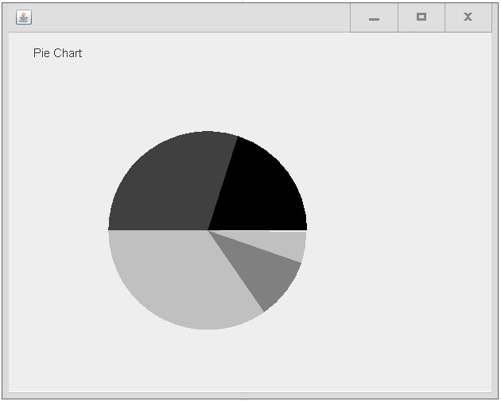
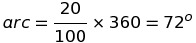
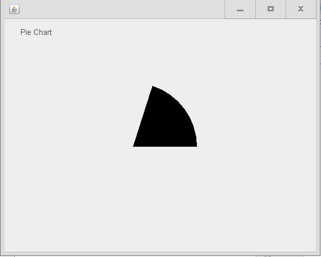

#### Pie Chart




#### Draw a pie chart using Java Graphics

Suppose we have five grades:

* A  ( 20% students)
* B ( 30% students)
* C ( 35% students)
* D (10% students)
* F (5% students)


20% of the students have scored A. We want to draw an arc, that represents those 20% students out of the whole class.

First we need to convert this number into a value of this arc. We do that by calculating:




Now we write a function to calculate this number for us:

```java
public int getAngleLength(int grade){
        int length = (int) ((grade / 100.0 ) * 360);
        return length;
    }
```

To draw an arc we call the Graphics object `g` within the `paint()` method, an arc drawn using Java Graphics Swing package is defined as a portion of a circle bound in a rectangle of a certain dimension, example:

Our circle will be drawn in a rectangle which its` top left corner is located at x, y coordinate of 100,100. The radius is 100, defined in our java file as follows:

```java
//Define starting points for drawing , pie radius, and the starting angle.
private int xStartPoint = 100;
private int yStartPoint = 100;
private int startAngle = 0;
private int radius = 100;
```
Lets draw our first arc :

```java
//Draw Arc for Grade A
g.setColor(Color.BLACK); //Set the color of the arc to black

//This draws the first arc of length 72 degrees.
g.fillArc(xStartPoint,yStartPoint,2*radius,2*radius,startAngle,getAngleLength(gradeA));

//We update the starting angle by adding to it the value of the arc that we just drew.
startAngle+= getAngleLength(gradeA); 
```

Now if we run the program we will get:




We do the same thing for the rest of the arcs, **remember** we have to update the starting angle for each arc.

```java
//Draw Arc for Grade B
g.setColor(Color.DARK_GRAY);
g.fillArc(xStartPoint,yStartPoint,2*radius,2*radius,startAngle,getAngleLength(gradeB));
startAngle+= getAngleLength(gradeB);
```
![[pie2.jpg]](pie2.jpg "pie2.jpg")


similarly the third arc:

```java
//Draw Arc for Grade C
g.setColor(Color.LIGHT_GRAY);
g.fillArc(xStartPoint,yStartPoint,2*radius,2*radius,startAngle,getAngleLength(gradeC));
startAngle+= getAngleLength(gradeC);
```


![[pie3.jpg]](pie3.jpg "pie3.jpg")


The 4th arc :

```java
//Draw Arc for Grade D
g.setColor(Color.gray);
g.fillArc(xStartPoint,yStartPoint,2*radius,2*radius,startAngle,getAngleLength(gradeD));
startAngle+= getAngleLength(gradeD);
```


![[pie4.jpg]](pie4.jpg "pie4.jpg")

and finally the 5th and last pie:

```java
//Draw Arc for Grade F
g.setColor(Color.LIGHT_GRAY);
g.fillArc(xStartPoint,yStartPoint,2*radius,2*radius,startAngle,getAngleLength(gradeF));
startAngle+= getAngleLength(gradeF);
```


![[pie5.jpg]](pie5.jpg "pie5.jpg")


#### What's next ?

We could improve this project by adding some values to the arcs, like a string to be placed somewhere close to Pie #1 , which represents the 20% with black color, same for the rest of the arcs. The code should be flexible such that if the values of the grades are modified , the string will move accordingly with the value of the arc to properly identify what the arc represents.

